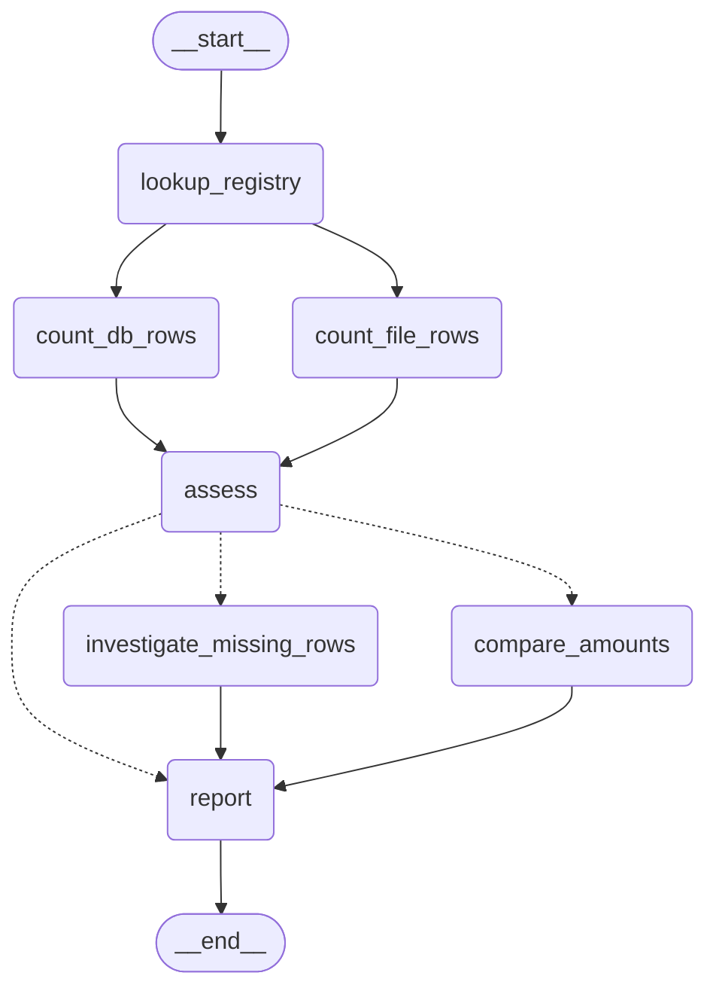

# LangGraph 到底解决了什么问题？

## —— 从一个会自己抓 ETL bug 的 Agent 讲起

> 本文不讲概念堆砌，只用一个能跑起来的真实项目 [`data-trace-agent`](../README-ZH.md) 做样本：
> 一个数据血缘排障智能体，挂两个 MCP server，专抓那种"数据库里看着没毛病、
> 跟源文件一比才发现被 ETL 悄悄改坏了"的 bug。
>
> 我们会用**同一个业务问题**，分别用 LangGraph 的两种写法实现一遍：
> 一种把决策权交给模型（ReAct），一种把流程焊死（StateGraph）。
> 对比之后，你会很清楚地知道 LangGraph 到底在提供什么，以及什么时候该用哪个。

---

## 0. 先看问题长什么样

值班工程师早上收到告警：今天的 `daily_metrics.total_revenue` 只有 6808.62，
而昨天是 18867.23 —— **掉了差不多 64%**。

数据库里的数据本身"完全正常"：没有 NULL，没有负数，没有重复主键，
所有能想到的 SQL 校验都是绿的。

因为问题根本不在数据库里。翻开上游那个 CSV 文件：

```
# data/sources/customer_b/2026-04-26.csv —— 80 行
order_id,user_id,amount,currency,ts
8000000,282,226.64,USD,2026-04-26T17:27:34
...
```

文件里躺着 80 笔订单（75 笔 EUR + 5 笔 USD），而数据库 `customer_b_orders_raw`
今天**只有 5 行**。加载器把非 USD 的行全静默吃掉了：

```python
# setup_warehouse.py —— 故意埋下的 bug #1
if row["currency"] != "USD":
    continue                       # 75 笔 EUR 订单人间蒸发，没有任何日志
```

同一个仓库里还埋了 bug #2，更阴险 —— 它**连行数都不差**：

```python
# 文件里是 119.06，加载时用 int() 砍掉了小数
(int(row["order_id"]), int(row["user_id"]), int(float(row["amount"])), row["ts"])
#                                            ^^^ 本该是 float()
```

这两个 bug 的共同点是：**光查 DB 永远发现不了。** 你必须把
"DB 里现在有什么" 和 "文件里本来有什么" 并排比，差异才会浮现。

于是这个 Agent 需要两类工具，正好对应两个 MCP server：

| MCP server | 回答的问题 | 工具 |
| --- | --- | --- |
| `sqllite-mcp-server` | 现在有什么 | `execute_query`、`describe_table` … |
| `filesystem-mcp-server` | 本来应该有什么 | `read_file`、`list_directory` … |

问题定义清楚了。下面进入正题。

---

## 1. LangGraph 是什么：一句话版本

**LangGraph 不是"又一个 Agent 框架"，它是一个给 LLM 应用用的状态机执行引擎。**

它只关心三件事，而且这三件事你在任何 Agent 里都躲不掉：

1. **State** —— 这一轮跑下来，数据长什么样、谁能改、并发写了怎么合并；
2. **Node** —— 一个步骤就是一个普通函数：吃 State，吐"要写回 State 的东西"；
3. **Edge** —— 跑完这个节点，下一个跑谁？可以写死，也可以临场判断。

把这三样拼起来 `compile()` 一下，你得到一个可调用、可流式输出、可加检查点、
可中断恢复的对象。**"节点里是不是调 LLM"，LangGraph 根本不在乎** ——
这是理解它最关键的一点，也是它比"Agent 框架"这个标签宽得多的原因。

于是就有了两种极端用法，我们一个一个看。

---

## 2. 路线 A：把决策权交给模型（`create_react_agent`）

### 2.1 建图只要三行

`trace_agent.py` 里，整个 Agent 的构建就这么点代码：

```python
# trace_agent.py
async def build_agent():
    client = MultiServerMCPClient({
        "sqlite-db": {
            "command": sys.executable,
            "args": [SQLITE_MCP_MAIN],
            "transport": "stdio",
            "cwd": MCP_DIR,
        },
        "filesystem": {
            "command": sys.executable,
            "args": [FS_MCP_MAIN],
            "transport": "stdio",
            "cwd": MCP_DIR,
        },
    })
    tools = await client.get_tools()
    agent = create_react_agent(_make_llm(), tools, prompt=SYSTEM_PROMPT)
    return client, agent
```

`create_react_agent` 是 LangGraph 预制的一张图，展开其实就两个节点在打转：

```
START ──> [ agent: 调 LLM ] ──?──> [ tools: 执行工具 ] ──┐
                  ↑                                      │
                  └──────────────────────────────────────┘
                  │
                  └──?──> END       # 模型不再要求调工具时
```

条件边的判断逻辑朴素到一句话：**模型这轮吐了 `tool_calls` 就去 tools 节点，
没吐就结束。** 循环几次、先查库还是先读文件、查完发现不对要不要回头再查 ——
**全是模型现场决定的，代码里一个 `if` 都没写。**

### 2.2 Prompt 才是真正的"流程定义"

正因为代码里没有流程，流程就跑到 prompt 里去了。`SYSTEM_PROMPT` 在这个项目里
是**契约**，不是客套话，它干了三件硬事：

```python
# trace_agent.py —— 节选
"""
# Warehouse SQLite database
Path: `{DB_PATH}`
Always pass this exact path as the `db_path` arg to SQL tools.   # ← 1. 工具的使用约束

Metadata tables — your authoritative lineage / source map:
  - `_field_lineage(target_table, target_field, ...)`            # ← 2. 去哪儿找线索
  - `_source_registry(source_table, source_uri, file_dir, loader, schema_note)`

- Anomaly playbook: query the recent series, compute today vs prior-30d       # ← 3. 解题套路
  average, look up lineage in `_field_lineage`, then drill into each upstream
  raw table for the same day. If a raw table looks short, *also* look up its
  file in `_source_registry` and read the file with the filesystem tools —
  the file may contain rows the loader silently dropped.
"""
```

注意第 2 点：**血缘元数据是查得到的 SQL 表，不是塞在 prompt 里的文本。**

```sql
_field_lineage(target_table, target_field, source_table, source_field, transform, etl_job)
_source_registry(source_table, source_uri, file_dir, loader, schema_note)
```

这是个刻意的设计。血缘关系会变、会长，塞进 prompt 就等于把它冻在代码里；
放进 DB，Agent 自己会去查，加一条新链路不用动一行 prompt。

### 2.3 跑起来是什么样

```bash
python3 setup_warehouse.py
export OPENROUTER_API_KEY=...
python3 trace_agent.py
```

问它开头那个问题，它自己摸索出了完整链路：先查 `daily_metrics` 近 30 天序列
算出跌幅，再查 `_field_lineage` 找到 `total_revenue` 的上游是两张订单表，
接着查 `customer_b_orders_raw` 发现今天只有 5 行 —— 到这里 SQL 已经到头了，
于是它去查 `_source_registry` 拿到文件路径，切换到 filesystem MCP 把 CSV 读出来，
数出 80 行，最后指认 `load_customer_b_orders`。

**这条路径没有任何一步是我们写死的。** 这就是 ReAct 的魅力，也是它的风险。

### 2.4 ReAct 的代价，写在代码里

```python
# trace_agent.py
async def astream_events(agent, history: list, user_text: str, recursion_limit: int = 60):
    async for chunk in agent.astream(
        {"messages": history},
        config={"recursion_limit": recursion_limit},   # ← 这个参数为什么必须有
        stream_mode="updates",
    ):
```

`recursion_limit=60` 是保险丝：**模型可能绕圈子绕到天荒地老。** 这行代码本身
就是 ReAct 代价的自白书：

- **不确定** —— 同一个问题两次跑，路径可能不一样（所以测试里 `temperature=0`）；
- **贵且慢** —— 每一步都是一次 LLM 往返，一个问题烧掉十几次调用很常见；
- **难测** —— 端到端测试只能断言最终答案里的关键词：

  ```python
  # tests/test_lineage_qa.py 的断言风格
  assert "customer_b" in answer.lower()
  assert "load_customer_a_orders" in answer.lower()
  assert "truncat" in answer.lower()
  ```

那么问题来了：如果这个排查套路我**每天都要对四张表跑一遍**，
步骤我心里门儿清，我还需要模型每次现场即兴发挥吗？

**不需要。这时候就该把流程焊死。**

---

## 3. 路线 B：把流程焊死（`StateGraph`）

完整可运行代码在 👉 **[`examples/fixed_flow_lineage_check.py`](../examples/fixed_flow_lineage_check.py)**

它做的事和 ReAct agent 一模一样 —— 查 DB、读源文件、比对、指认加载器 ——
但**不需要 LLM，不需要 API key**，纯确定性执行：

```bash
python3 examples/fixed_flow_lineage_check.py                        # 体检全部 4 张表
python3 examples/fixed_flow_lineage_check.py customer_b_orders_raw --stream
python3 examples/fixed_flow_lineage_check.py --mermaid              # 打印图结构
```

下面对着这份代码，把 LangGraph 的三个核心概念过一遍。

### 3.1 State：并行写同一个 key 会炸，除非你给它 reducer

```python
# examples/fixed_flow_lineage_check.py
class CheckState(TypedDict, total=False):
    source_table: str                          # 输入：要体检的原始表
    report_date: str                           # 输入：体检哪一天
    source_uri: str                            # 由 _source_registry 查出
    loader: str
    file_path: str
    db_rows: int
    file_rows: int
    findings: Annotated[list[str], operator.add]   # ← 注意这一行
    verdict: str
```

**节点的返回值是"增量"，会被合并进 State，而不是替换整个 State。**
默认合并策略是"后写覆盖"。

`findings` 那行的 `Annotated[list[str], operator.add]` 是重点：它给这个 key
挂了一个 **reducer**。后面 `count_db_rows` 和 `count_file_rows` 会**并行**跑，
两个都往 `findings` 里 append —— 没有 reducer，LangGraph 会直接甩你一个
`InvalidUpdateError`（两个分支在同一步写同一个 key，它不知道该听谁的）；
有了 `operator.add`，两个列表会被拼起来。

**这是并行分支能安全写同一个 key 的唯一办法**，也是新手最容易踩的坑。

### 3.2 Node：就是个普通函数，一点都不神秘

```python
def lookup_registry(state: CheckState) -> dict:
    """查 `_source_registry`：这张表的物理文件在磁盘哪里、谁加载的。"""
    with sqlite3.connect(DB_PATH) as conn:
        row = conn.execute(
            "SELECT source_uri, file_dir, loader FROM _source_registry WHERE source_table = ?",
            (state["source_table"],),
        ).fetchone()
    source_uri, file_dir, loader = row
    matches = glob.glob(os.path.join(file_dir, f"{state['report_date']}.*"))
    return {"source_uri": source_uri, "loader": loader, "file_path": matches[0]}
```

对照看：ReAct agent 里"决定去查元数据表"这一步，是模型读了 prompt 之后**自己想到的**；
这里，它是流程的第一个节点，**没有任何跳过它的可能**。

拿到路径之后，两个互不依赖的节点分别去数 DB 行数和文件行数：

```python
def count_db_rows(state: CheckState) -> dict:
    """DB 侧：加载器**实际写进来**了多少行。"""
    ...
    return {"db_rows": n, "findings": [f"DB `{state['source_table']}` 当天 {n} 行"]}


def count_file_rows(state: CheckState) -> dict:
    """文件侧：上游**本来给了**多少行。CSV 要去掉表头，其余按非空行算。"""
    ...
    return {"file_rows": n, "findings": [f"源文件 `{os.path.basename(path)}` {n} 行"]}
```

### 3.3 Edge：写死的边 + 条件边

```python
def build_graph():
    g = StateGraph(CheckState)

    for fn in (lookup_registry, count_db_rows, count_file_rows, assess,
               investigate_missing_rows, compare_amounts, report):
        g.add_node(fn.__name__, fn)

    g.add_edge(START, "lookup_registry")

    # fan-out：查 DB 和读文件互不依赖，同一步并发跑，join 在 assess。
    g.add_edge("lookup_registry", "count_db_rows")
    g.add_edge("lookup_registry", "count_file_rows")
    g.add_edge("count_db_rows", "assess")
    g.add_edge("count_file_rows", "assess")

    g.add_conditional_edges("assess", route_after_assess)

    g.add_edge("investigate_missing_rows", "report")
    g.add_edge("compare_amounts", "report")
    g.add_edge("report", END)

    return g.compile()
```

两个知识点藏在这段里：

**① 并行是"连出去两条边"连出来的，不是配置出来的。**
`lookup_registry` 出去两条边，这两个节点就在同一步并发执行；
它们又都指向 `assess`，`assess` 就成了 join 点 —— **两个分支都跑完才会执行它**。

**② 条件边的路由函数只回答"下一个跑谁"，不改 State。**

```python
def route_after_assess(
    state: CheckState,
) -> Literal["investigate_missing_rows", "compare_amounts", "report"]:
    if state["db_rows"] != state["file_rows"]:
        return "investigate_missing_rows"        # customer_b：80 行进来只剩 5 行
    if state["source_table"] in AMOUNT_TABLES:
        return "compare_amounts"                 # customer_a：行数对得上，但金额被截断
    return "report"                              # 点击流 / 应用日志：对照组，直接收工
```

返回值类型标成 `Literal[...]`，LangGraph 就能据此把分支画进图里 ——
所以别偷懒写成 `-> str`，画出来的图会缺边。

这个三岔路口正是**业务知识的结晶**：行数不一致是一类 bug（丢行），
行数一致但值不对是另一类（改写），而两者都没有的表根本不用深查。
在 ReAct 版里，这个判断藏在 prompt 的 playbook 里靠模型悟；在这里，它是三行 `if`。

### 3.4 编译出来的图长这样

`--mermaid` 直接把图打出来（`graph.get_graph().draw_mermaid()`，
不用装任何额外依赖），实线是固定边，虚线是条件边：



### 3.5 真实运行结果

```
$ python3 examples/fixed_flow_lineage_check.py

=== s3_clickstream_raw ===
  · DB `s3_clickstream_raw` 当天 1000 行
  · 源文件 `2026-04-26.json` 1000 行
  · 行数一致
  → OK：`load_s3_clickstream` 未见异常

=== app_logs_raw ===
  · DB `app_logs_raw` 当天 500 行
  · 源文件 `2026-04-26.log` 500 行
  · 行数一致
  → OK：`load_app_logs` 未见异常

=== customer_a_orders_raw ===
  · DB `customer_a_orders_raw` 当天 51 行
  · 源文件 `2026-04-26.csv` 51 行
  · 行数一致
  · 金额不一致样例：order 7000000: 文件 119.06 → DB 119.0; order 7000001: 文件 100.88 → DB 100.0
  → BUG：`load_customer_a_orders` 把金额截断成整数 —— 50/51 笔不一致

=== customer_b_orders_raw ===
  · DB `customer_b_orders_raw` 当天 5 行
  · 源文件 `2026-04-26.csv` 80 行
  · 行数对不上：文件比 DB 多 75 行
  · 丢失行按币种分组：{'EUR': 75}
  → BUG：`load_customer_b_orders` 静默丢行 —— 文件 80 行，DB 只有 5 行；丢失的 75 行币种分布为 EUR×75
```

两个 bug 全中，两个干净数据源（点击流、应用日志）作为对照组正确放行。
**零次 LLM 调用，零成本，毫秒级，每次结果完全一样。**

---

## 4. 两条路怎么选

| | ReAct（`create_react_agent`） | 固定流程（`StateGraph`） |
| --- | --- | --- |
| 下一步谁决定 | 模型 | 你的 `if` |
| 流程写在哪 | prompt 里的 playbook | 代码里的边 |
| 处理没见过的问法 | ✅ 强 | ❌ 不在图里就是不会 |
| 结果确定性 | ❌ 每次可能不同 | ✅ 完全一致 |
| 成本 / 延迟 | 每步一次 LLM 往返 | 本例为 0 |
| 可测试性 | 只能断言关键词 | 普通单元测试 |
| 出错时排查 | 读一长串 trace | 看是哪个节点 |

一句话选型：

> **问题空间开放、问法不可穷举 → ReAct。
> 套路已经固化、每天都要跑 → StateGraph。**

`data-trace-agent` 这个仓库两边都占：

- 值班工程师半夜甩来一句"这个数怎么不对"，问法千奇百怪 → 交给 `trace_agent.py` 的 ReAct agent；
- 每天早上 8 点把四张源表全体检一遍，出报表 → 用 `examples/fixed_flow_lineage_check.py` 这种固定流程，
  跑得快、不烧钱、结果能进断言。

**而且它们能混着用。** 最常见的生产形态是：固定流程负责取数、校验、
拼上下文这些脏活累活，中间插一个节点调 LLM 做只有模型擅长的那部分
（比如"把这堆差异写成人话发给业务方"）。因为**节点就是个普通函数，
里面调不调 LLM，图不关心** —— 这正是第 1 节那句话的分量所在。

---

## 5. 一个通用的调试抓手：`stream_mode="updates"`

最后说个两条路线通吃的实用技巧。ReAct agent 这么看模型每一步在干嘛：

```python
# trace_agent.py
async for chunk in agent.astream({"messages": history},
                                 config={"recursion_limit": 60},
                                 stream_mode="updates"):
```

固定流程这么看每个节点写回了什么：

```python
# examples/fixed_flow_lineage_check.py
for chunk in graph.stream(payload, stream_mode="updates"):
    for node, update in chunk.items():
        print(f"  [{node}] {update}")
```

**同一个机制。** `updates` 模式下，每个节点跑完就吐一次
`{节点名: 它写回 State 的增量}`。跑一下：

```
$ python3 examples/fixed_flow_lineage_check.py customer_b_orders_raw --stream

=== customer_b_orders_raw ===
  [lookup_registry] {'source_uri': 'api://customer-b/orders', 'loader': 'load_customer_b_orders', 'file_path': '.../customer_b/2026-04-26.csv'}
  [count_file_rows] {'file_rows': 80, 'findings': ['源文件 `2026-04-26.csv` 80 行']}
  [count_db_rows] {'db_rows': 5, 'findings': ['DB `customer_b_orders_raw` 当天 5 行']}
  [assess] {'findings': ['行数对不上：文件比 DB 多 75 行']}
  [investigate_missing_rows] {'verdict': 'BUG：`load_customer_b_orders` 静默丢行 ...'}
  [report] {'verdict': 'BUG：`load_customer_b_orders` 静默丢行 ...'}
```

整个执行过程一览无余，连**并行的两个节点谁先返回**都看得见
（`count_file_rows` 先于 `count_db_rows` —— 它俩是同一步并发的，
返回顺序本就不保证，这也侧面印证了 3.1 节那个 reducer 不是多余的）。

Web 端那套实时工具调用日志，也不过是把这个流套了层 WebSocket：

```python
# web_app.py —— 把同一个事件流推给浏览器
async for ev in astream_events(agent, history, user_text):
    # `args` may include non-JSON-serializable values; coerce.
    safe = _jsonable(ev)
    await socket.send_json(safe)
```

---

## 6. 小结

1. **LangGraph 的本体是 State + Node + Edge 这个执行引擎**，"Agent" 只是它上面
   一层预制图（`create_react_agent`）。看懂这点，你就不会问"LangGraph 和
   XX Agent 框架比哪个强"了 —— 不是一个层面的东西。
2. **决策权是可以滑动的**：全交给模型（ReAct）、全焊死（StateGraph）、
   或者流程焊死但留几个节点给模型 —— 后者往往才是生产环境的答案。
3. **并行 fan-out 写同一个 key，必须配 reducer**（`Annotated[list, operator.add]`），
   这是踩坑率最高的一条。
4. **`stream_mode="updates"` 是通用抓手**，两种写法都靠它看清里面到底发生了什么。
5. 最后，回到那个数据 bug 本身：**只查 DB 是发现不了它的，只让模型"凭空推理"
   也发现不了。** 必须真的把文件读出来，和 DB 并排比。工具，比模型更重要。

---

## 相关代码

| 文件 | 内容 |
| --- | --- |
| [`examples/fixed_flow_lineage_check.py`](../examples/fixed_flow_lineage_check.py) | **本文路线 B 的完整示例**，`StateGraph` 固定流程，无需 LLM 即可运行 |
| [`trace_agent.py`](../trace_agent.py) | 路线 A：`create_react_agent` + 两个 MCP server + REPL |
| [`setup_warehouse.py`](../setup_warehouse.py) | 构建模拟仓库，两个 bug 就埋在这儿 |
| [`web_app.py`](../web_app.py) | FastAPI + WebSocket 的 Web 界面 |
| [`docs/In-depth-analysis-of-ReAct.md`](./In-depth-analysis-of-ReAct.md) | 姊妹篇：从 CoT 到 ReAct 再到"会自己思考"的模型 |
| [`README-ZH.md`](../README-ZH.md) | 项目说明与快速开始 |
